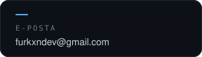
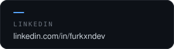
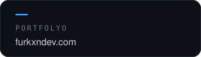

  

  

 

  

 

##  &nbsp;Teknolojiler

  

 

##  &nbsp;Öne Çıkan Projeler

<table>
<tr>
<td width="50%" valign="top">

### 🍽️ Masapp &nbsp;🔒 özel

QR ile masadan sipariş, hesap bölüşme ve kartla ödeme. İşletme tarafında canlı sipariş ve masa yönetimi.

- Socket.IO ile müşteri ekranı ↔ panel anlık senkron
- Hesap bölüşme: tüm hesap, kişi başı veya seçili ürün
- Paylaşılan sözleşme paketi — frontend ham `fetch` çağırmaz

`NestJS` `Prisma` `PostgreSQL` `Socket.IO` `React 19` `İyzico`

</td>
<td width="50%" valign="top">

### 🗺️ [Gezio](https://gezio.furkxndev.com) &nbsp;🔒 özel

Bütçe, süre ve ilgi alanına göre gün gün seyahat programı üreten AI destekli platform.

- Başkasının rotasını kendi bütçene göre yeniden kurgulama
- OpenAPI 3 ile belgelenmiş, üçüncü partilere açık REST API
- Tek origin mimarisi — nginx `/api` proxy'si, CORS yok

`NestJS` `TypeORM` `PostgreSQL 17` `React 19` `Docker` `nginx`

</td>
</tr>
<tr>
<td width="50%" valign="top">

### 🐾 [PatiBak](https://github.com/furkxndev/patibak)

Sahiplendirme ve geçici bakıcı eşleştiren uçtan uca mobil platform.

- Okundu bilgili gerçek zamanlı mesajlaşma
- JWT + BCrypt oturum, doğrulanmış hesap sistemi
- Güven puanı ve yorum tabanlı profil analizi

`React Native` `Expo Router` `Node.js` `MySQL` `Sequelize`

</td>
<td width="50%" valign="top">

### 🥗 [AIfiyet](https://aifiyet.site)

Eldeki malzemeye göre AI ile tarif ve besin değeri üreten beslenme platformu.

- Gemini 2.5 Flash; tehlikeli girdileri reddeden güvenlik katmanı
- Controller → Service → Repository katmanlı mimari
- Docker Compose ile tek komutta ayağa kalkar

`Java 17` `Spring Boot` `JPA` `PostgreSQL` `Gemini API` `Docker`

</td>
</tr>
<tr>
<td width="50%" valign="top">

### 🔔 [OBS Not Bildirici](https://github.com/furkxndev/sinav-bildirim)

Yeni açıklanan sınav sonuçlarını Telegram'dan bildiren, GitHub Actions üzerinde 7/24 ücretsiz çalışan bot.

- Playwright ile oturum açma ve sayfa karşılaştırması
- Gizlilik önceliği: puan değil yalnızca "açıklandı mı" saklanır
- Rastgele gecikme ve saat kısıtıyla engellenmeye karşı korumalı

`Python` `Playwright` `Telegram Bot API` `GitHub Actions`

</td>
<td width="50%" valign="top">

### 🎮 [Karanlık Tuzak](https://github.com/furkxndev/Karanlik-Tuzak) · [Top Climbing](https://github.com/furkxndev/Top-Climbing)

Unity ile iki mobil 2D oyun: troll platformer ve fizik tabanlı tırmanma.

- Sprite, ses ve geometri dahil her şey runtime'da üretiliyor
- Coyote-time + jump-buffer ile hassas zıplama hissi
- Chunk üretimi ve nesne havuzuyla sonsuz arazi

`Unity 2022.3` `C#` `URP 2D` `2D Physics`

</td>
</tr>
</table>

##  &nbsp;Deneyim & Eğitim

  

 

##  &nbsp;GitHub

  
  

 

##  &nbsp;İletişim

Yeni projelere ve iş birliklerine açığım — bir fikri konuşmak istersen yazman yeterli.

  
  
  
  

 

  

