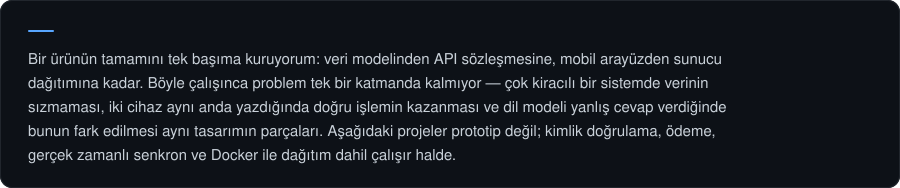

  

 

  

## Seçilmiş Projeler

<table>
<tr>
<td width="50%" valign="top">

</td>
<td width="50%" valign="top">

</td>
</tr>
<tr>
<td width="50%" valign="top">

</td>
<td width="50%" valign="top">

</td>
</tr>
<tr>
<td width="50%" valign="top">

</td>
<td width="50%" valign="top">

</td>
</tr>
</table>

<b>Diğer çalışmalar</b>

 

| Proje | Açıklama | Teknolojiler |
| :--- | :--- | :--- |
| [Paydaş](https://github.com/furkxndev/paydas) | Ortak gider ve görev yönetimi; borçları en az sayıda transfere indirgeyen hesap kapatma | React Native · NestJS · PostgreSQL |
| [PatiBak](https://github.com/furkxndev/patibak) | Sahiplendirme ve geçici bakıcı eşleştirme; okundu bilgili gerçek zamanlı mesajlaşma | React Native · Node.js · MySQL |
| [AIfiyet](https://github.com/furkxndev/aifiyet) | Eldeki malzemeye göre tarif ve besin değeri üretimi; katmanlı mimari | Java 17 · Spring Boot · Gemini API |
| [OBS Not Bildirici](https://github.com/furkxndev/sinav-bildirim) | Sınav sonucu bildiren bot; puan değil yalnızca "açıklandı mı" saklanıyor | Python · Playwright · GitHub Actions |
| [Karanlık Tuzak](https://github.com/furkxndev/Karanlik-Tuzak) | Sahne kurulumu olmadan, sprite ve geometri dahil her şeyi runtime'da üreten 2D platformer | Unity · C# · URP 2D |
| [Top Climbing](https://github.com/furkxndev/Top-Climbing) | Chunk üretimi ve nesne havuzuyla sonsuz prosedürel arazi, WheelJoint2D süspansiyon | Unity · C# · 2D Physics |

## Teknolojiler

  

## İletişim

<table>
<tr>
<td width="33.33%" valign="top">

</td>
<td width="33.33%" valign="top">

</td>
<td width="33.33%" valign="top">

</td>
</tr>
</table>
