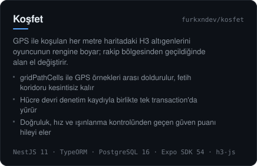
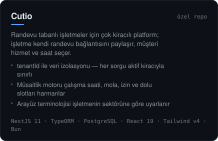
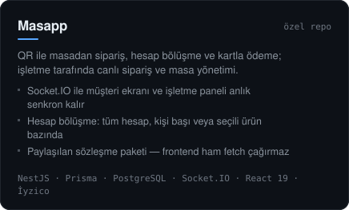
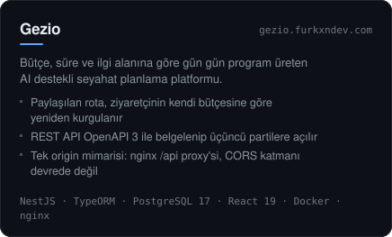
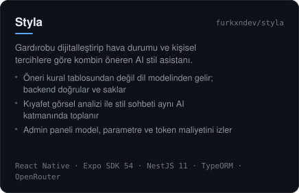
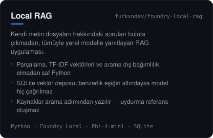

  

  

 

  

 

##  &nbsp;Teknolojiler

  

 

##  &nbsp;Öne Çıkan Projeler

<table>
<tr>
<td width="50%" valign="top">

</td>
<td width="50%" valign="top">

</td>
</tr>
<tr>
<td width="50%" valign="top">

</td>
<td width="50%" valign="top">

</td>
</tr>
<tr>
<td width="50%" valign="top">

</td>
<td width="50%" valign="top">

</td>
</tr>
<tr>
<td width="50%" valign="top">

</td>
<td width="50%" valign="top">

</td>
</tr>
<tr>
<td width="50%" valign="top">

</td>
<td width="50%" valign="top">

</td>
</tr>
</table>

  

  <a href="https://github.com/furkxndev/Karanlik-Tuzak">Karanlık Tuzak</a> &nbsp;·&nbsp;
  <a href="https://github.com/furkxndev/Top-Climbing">Top Climbing</a>

##  &nbsp;Deneyim & Eğitim

  

 

##  &nbsp;GitHub

  
  

 

##  &nbsp;İletişim

Yeni projelere ve iş birliklerine açığım — bir fikri konuşmak istersen yazman yeterli.

  
  
  
  

 

  

